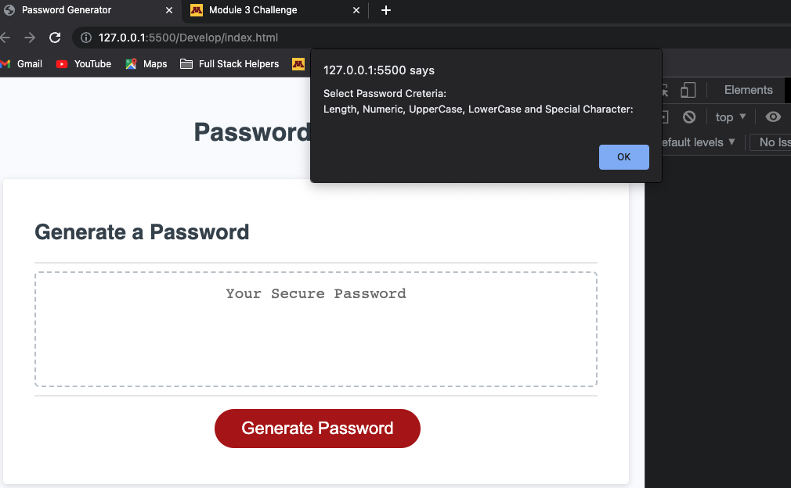
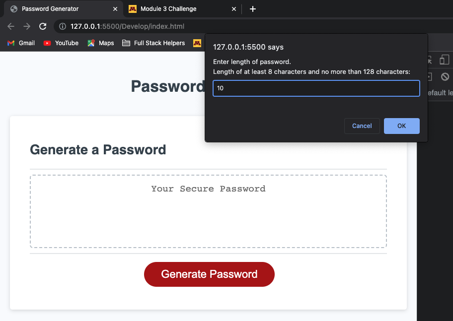
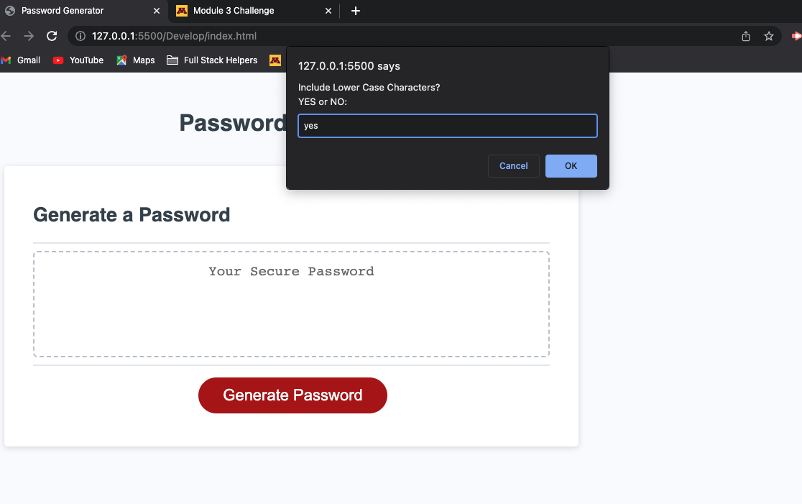
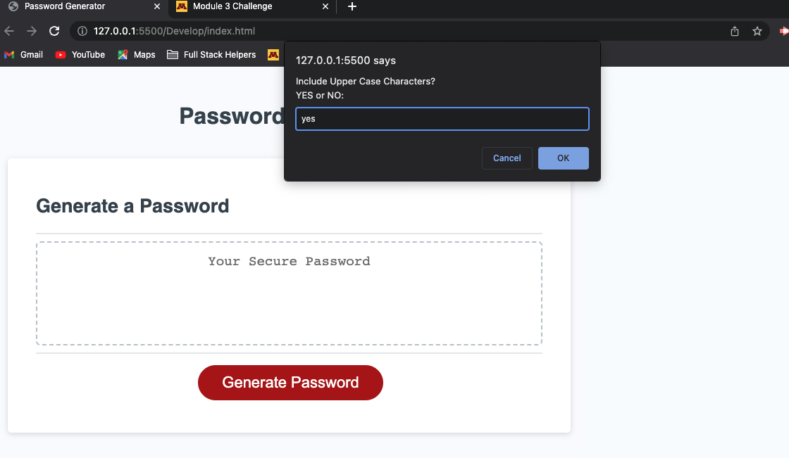
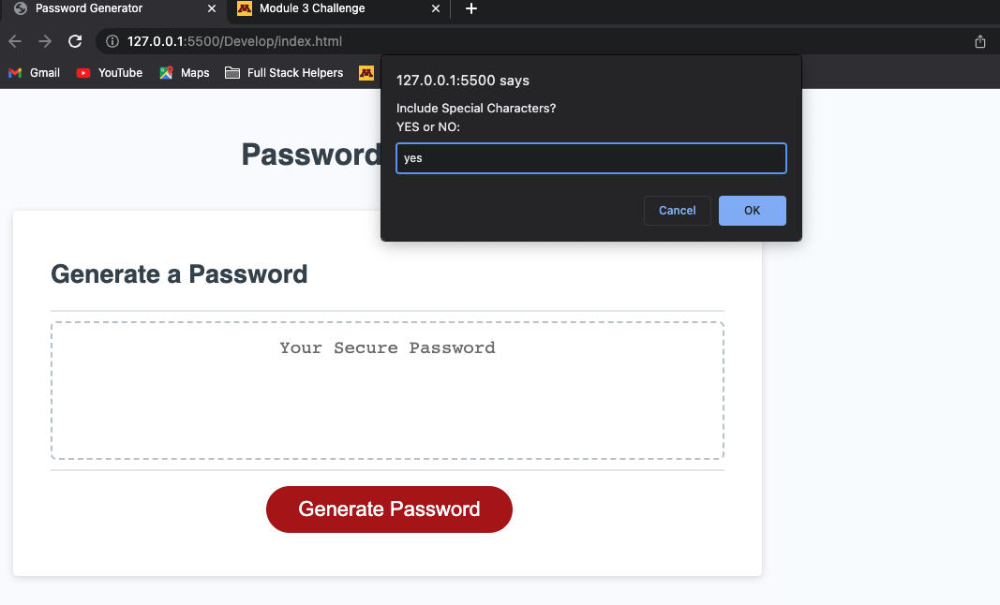
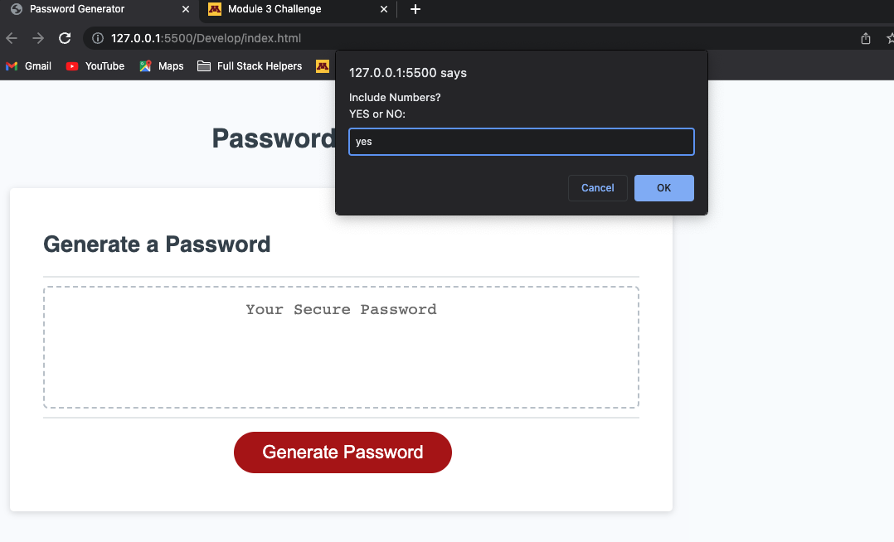
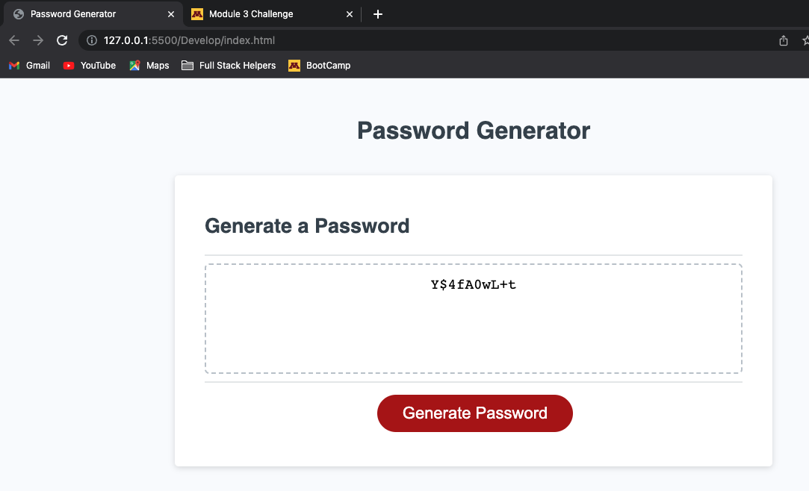

# Password Generator

This repo host's app to generate's strong password that includes Upper Case, Lower Case characters, numeric and special character.

User is allowed to choose the password criteria to generate password. It is recommended to choose or select all the password criteria to generate storng password for security reasons.

## Screenshots of Application.

Mentioned below are the steps to use the app.

- Once webpage is opened. Alert will be displayed to select the password criteria.

- Type the length of the password to be generated.

- Include Lower Case?

- Include Upper Case?

- Include Special Characters?

- Include Numbers?

- Final Password.

## Application Repo and Links

- [GIT repo](https://github.com/kvvadavi/Module03Challenge)
- [Application Link]()